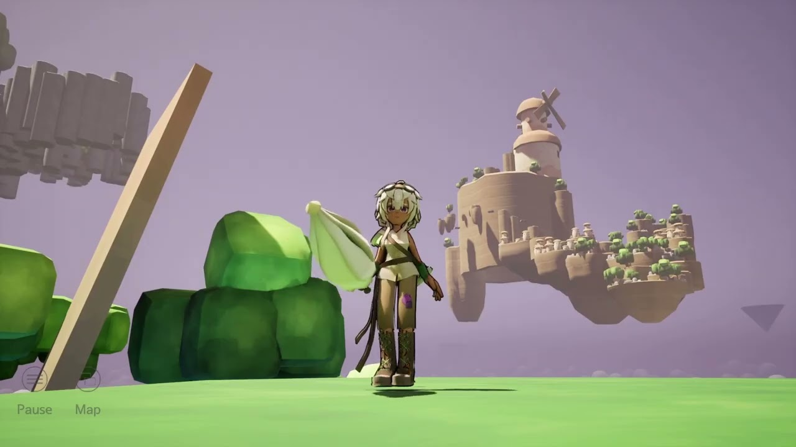

# Wander Blossom
10 weeks to create a retro-like, action-adventure game in Unreal Engine.

[Click to see the trailer on YouTube](https://youtu.be/2RYzSmP6kX0?si=uAdH4-WLWKr4deOE)

---

## Team
- Guillaume **CAUSSY**
- Aina **GRATIOT**
- [Monika **SAMBLAS MATUTE**](https://linktr.ee/MissMnk)
- [Nicolas **SAVY-LARIGALDIE**](https://linktr.ee/nicosavlar) (me)

## 2D
- Monika **SAMBLAS MATUTE**

## 3D
- Guillaume **CAUSSY**
- Aina **GRATIOT**
- Monika **SAMBLAS MATUTE**

## Animation
- Monika **SAMBLAS MATUTE**

## Concept Art
- Aina **GRATIOT**

## Development
- Nicolas **SAVY-LARIGALDIE**

## Game Design
- Guillaume **CAUSSY**
- Nicolas **SAVY-LARIGALDIE**

## Level Design
- Guillaume **CAUSSY**

## Lighting
- Nicolas **SAVY-LARIGALDIE**

## Sound Design
- Guillaume **CAUSSY**
- Nicolas **SAVY-LARIGALDIE**

## Texturing
- Monika **SAMBLAS MATUTE**
